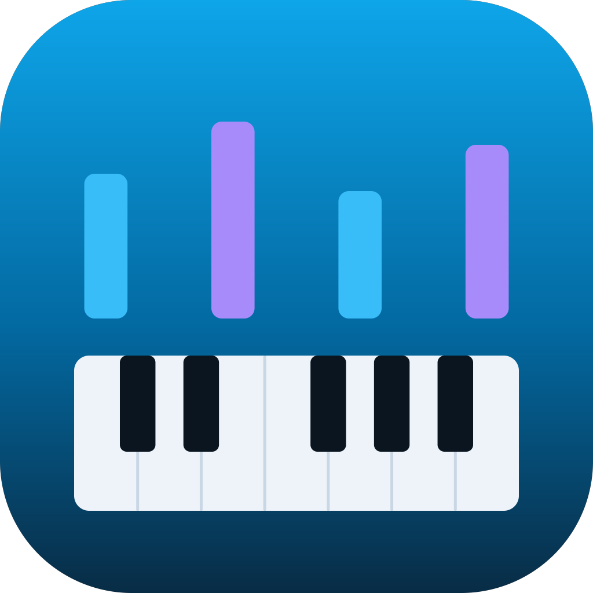

<div align="center">



# Piano MIDI

**Learn piano step by step with a MIDI keyboard — offline, on your desktop.**

16 units from finding Middle C to reading both clefs, designed around a 25-key
controller so it never asks for a note you do not have.

</div>

---

## What it does

- **Finds your keyboard by itself.** Auto-detects MIDI on startup and while
  running, so plugging a keyboard in mid-session just works. Manual device
  picker if you want it, and it skips software buses and controller "editor"
  ports, which carry no notes.
- **Sounds like a piano.** Bundled Salamander Grand Piano samples, playing
  locally with no network access at all.
- **Teaches reading, not just pressing.** Landmark-based note reading, interval
  shapes, rhythm as its own skill, chords and inversions, scales with the thumb
  crossing under.
- **Grades what you play.** Per-note timing and pitch, with feedback that says
  *why* a note was wrong — right letter wrong octave, missed accidental,
  neighbouring key — rather than just marking it red.
- **Falling notes when you want them, a staff always.** Every reading lesson
  has a staff-only graded pass, so the falling-note view can never quietly
  replace learning to read.
- **Free play** with live chord and interval naming, plus a metronome.

## Screens

| Lessons | A lesson |
|---|---|
| Unit map with progress and stars | Notation, falling notes, and your keyboard |

## Install

Download the latest build for your platform from
[Releases](https://github.com/madiers/piano-midi/releases).

- **macOS** — open the `.dmg` and drag the app to Applications. The build is
  not code-signed, so the first launch needs **right-click → Open** and then
  **Open** in the dialog. (Double-clicking shows a "cannot be opened" message;
  that is Gatekeeper, not a broken download.)
- **Windows** — run the installer. It is a normal multi-page wizard and lets
  you choose the install location. SmartScreen may warn that the publisher is
  unknown; choose **More info → Run anyway**.
- **Linux** — `.AppImage` (make it executable and run it) or `.deb`.

## Build from source

```bash
git clone https://github.com/madiers/piano-midi.git
cd piano-midi
npm install
npm run assets     # downloads the piano samples (~5 MB), needed once
npm run dev
```

Then:

```bash
npm test            # unit tests
npm run typecheck   # main, preload and renderer
npm run build:mac   # or build:win / build:linux
```

`npm run assets` is a separate step rather than a `postinstall` hook, because
silently downloading several megabytes during `npm install` is unfriendly —
especially in CI. The app still runs without it, falling back to a synthesised
tone.

## How it is put together

```
src/
  main/         Electron main — windows, IPC, asset protocol, updates, storage
  preload/      The single typed bridge exposed to the renderer
  shared/       Types and the IPC contract used by both sides
  renderer/src/
    midi/       Web MIDI input, device selection, hot-plug
    audio/      AudioContext, sampled piano, synth fallback, metronome
    music/      Pitch spelling, intervals, scales, chords  (no dependencies)
    lessons/    Grading, note matching, phrase generation, the curriculum
    components/ Keyboard, staff, falling notes, panels
    views/      Home, lesson, free play, settings
```

A few decisions worth knowing about, because they are not obvious from the code:

**Raw Web MIDI, not the `webmidi` package.** The popular wrapper pulls in
`jzz` → `jazz-midi`, which ships 16 prebuilt `.node` binaries. That would mean
native modules in the bundle, rebuild steps, and third-party binaries to sign
for notarization. The built-in API costs about 200 lines and no dependencies.

**`midiSysex` must be granted even though we never use SysEx.** Electron routes
the whole Web MIDI permission through `midiSysex`, so a handler that allows
only `midi` fails the request outright — and the app then looks like it simply
cannot see your keyboard. We still request access with `sysex: false`, so no
SysEx data is ever delivered.

**VexFlow 4, not 5.** v4 embeds its music glyphs as SVG outline paths. v5 loads
them through the `FontFace` API with a CDN default, which in a packaged offline
app under a strict CSP means blank staves.

**Sample tails are truncated on decode.** Salamander's bass samples run 20–26
seconds; the full set decodes to roughly 140 MB of resident audio. Trimming to
a few seconds costs nothing audible for beginner exercises and brings it to
about 58 MB. Adjustable in settings.

**The music is never transposed to fit the keyboard.** Units declare an octave
anchor and the app asks you to shift the keyboard instead. Silently moving the
music would break the link between a written note and the key under your
finger, which is the whole skill being taught.

## Designed around 25 keys

Two octaves is a real constraint, and it changes the curriculum in ways that
are easy to get wrong:

- The textbook C-position G7 is played B–F–G, needing B2. On a keyboard
  anchored at C3 that key does not exist, and no octave shift helps while the
  right hand is also in position. The course uses a voicing without the fifth.
- Right-hand G position runs G4–D5, which is off the top. **F major is taught
  before G major**, reversing the usual order, purely because F fits.
- No sustain pedal, so there is no pedal content. Finger legato is taught
  explicitly instead, and graded on note overlap.

A test expands every exercise in the curriculum — generator pools across
several seeds, all chord roots × qualities × inversions, scale runs, ear
training ranges — and fails if any note falls outside its lesson's range. It
caught two chord drills whose inversions climbed off the keyboard.

## Grading

Timing windows are a fraction of the beat, clamped to absolute bounds, rather
than the fixed windows rhythm games use:

| | ±window at 90 BPM | at 120 BPM |
|---|---|---|
| Perfect | 35 ms | 35 ms |
| Good | 73 ms | 70 ms |
| OK (also the accept window) | 133 ms | 120 ms |

Novice tap standard deviation is roughly 4–5% of the beat — about 30 ms at
90 BPM — so a game-style ±16 ms "perfect" would be earned by chance and teach
nothing. At the other end, two onsets are heard as separate at around 40 ms, so
±35 ms genuinely means "that sounded together".

Score is `0.65 × pitch + 0.35 × timing − extras penalty`, extras capped at
0.15. Stars at 0.60 / 0.80 / 0.93, with three stars also requiring full tempo.
A lesson unlocks the next at 80% score and 80% tempo.

Beginner and strict profiles scale every window by 1.5× and 0.7×. The beginner
profile also widens the *early* side, because novices systematically anticipate
the beat.

## Updates

The app checks GitHub Releases on startup and can update itself on Windows and
Linux. On macOS it cannot: Squirrel.Mac validates the code signature of the
replacement app, and these builds are unsigned. There, the app tells you a new
version exists and links to the download instead of failing silently.

Signing macOS properly needs an Apple Developer account ($99/year). The
updater code already handles it — setting a Developer ID and
`PIANO_MIDI_MAC_SIGNED=1` turns on true silent updates with no other change.
For Windows, [SignPath Foundation](https://signpath.org) offers free
certificates to qualifying open-source projects.

## Credits

Piano samples are **Salamander Grand Piano V3** by Alexander Holm, licensed
[CC BY 3.0](https://creativecommons.org/licenses/by/3.0/), obtained via the
MIT-licensed [`@audio-samples`](https://github.com/darosh/samples-piano-mp3)
packages by Jan Forst. No changes were made to the recordings beyond selecting
a subset of velocity layers.

The curriculum's *order* of concepts follows the modern landmark/eclectic
consensus shared by the well-known method books — which is factual and not
copyrightable. All lesson text, exercises and generated pieces here are
original.

## Licence

MIT — see [LICENSE](LICENSE).
